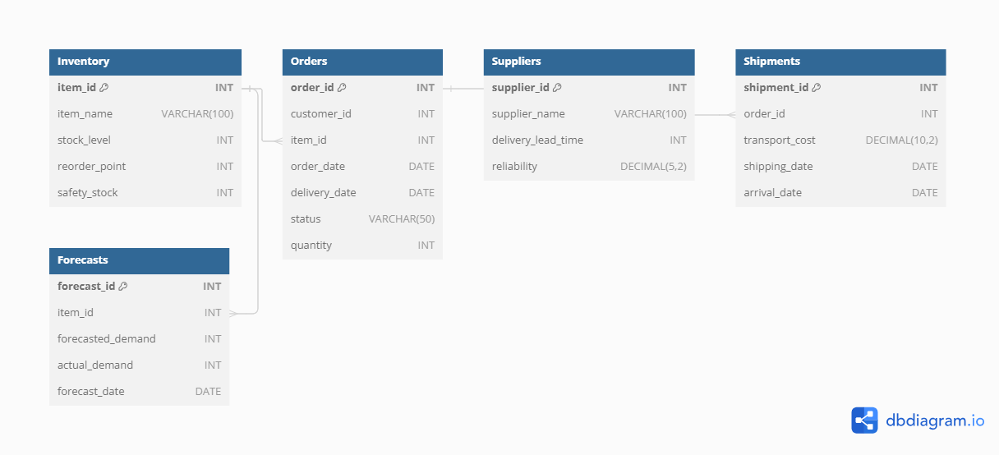

# Project Documentation: Supply Chain Performance Dashboard

## Overview
This document outlines the steps taken to create a Supply Chain Performance Dashboard, the database schema, the data sources, and how to maintain and update the system.

## Database Schema
The database consists of the following tables:
- **Inventory:** Tracks inventory levels and reorder points.
- **Orders:** Records customer orders and their statuses.
- **Suppliers:** Contains supplier details including reliability metrics.
- **Shipments:** Logs transportation costs and shipping details.
- **Forecasts:** Compares forecasted vs. actual demand.

## Power BI Dashboard
The Power BI dashboard visualizes key metrics like Inventory Levels, Order Fulfillment Rates, Lead Times, and more. Slicers allow filtering by time, product category, and supplier.

## How to Update
- **Data Refresh:** The Power BI dashboard is set to refresh data from the SQL database daily.
- **Adding New Data:** New data should be added to the SQL tables via SQL scripts or through Excel import.
